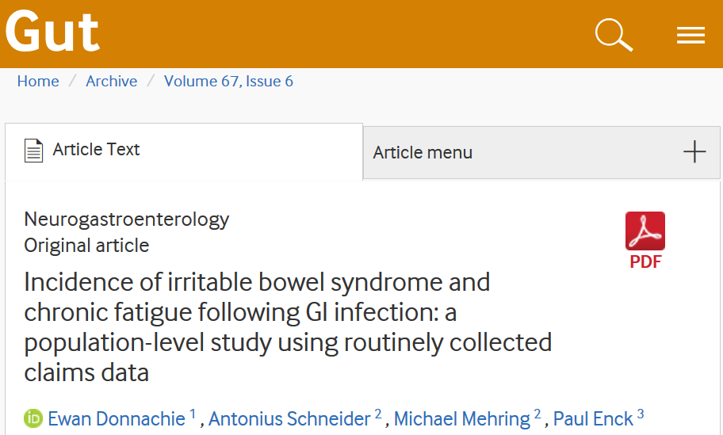
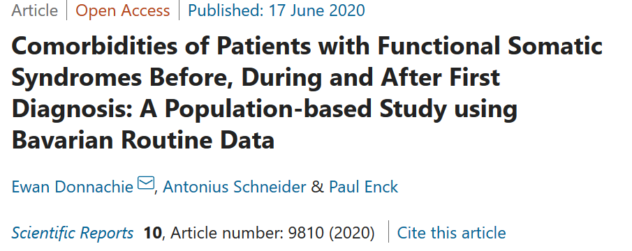

```{r setup, include=FALSE}
knitr::opts_chunk$set(echo = FALSE,
                      message = FALSE,
                      warnings = FALSE)
library(dplyr)
```

<div class = "notes">
Guten Tag. Mein Name ist Ewan Donnachie. Vielen Dank dass ich heute mein R-Package für den Umgang mit ICD-10-Metadeten vorstellen darf.
</div>

## Über mich

- Statistiker bei der Kassenärztlichen Vereinigung Bayerns    
    - Versorgungsanalysen und -forschung mit Routinedaten

- Externe Dissertation unter Verwendung der KVB-Routinedaten    
    - Betreuer:    
		  Prof. Paul Enck (Universitätsklinikum Tübingen)    
		  Prof. Antonius Schneider (TU München)
    - Funktionelle Erkrankungen in der ambulanten Versorgung

- Autor des R-Packages `ICD10gm`    
    - Bereitstellung der ICD-10-GM-Metadaten für die Versorgungsforschung
    - Strategien für die Auswertung von Verlaufsdaten
    - Dokumentation: https://edonnachie.github.io/ICD10gm


<div class = "notes">
Kurz zu meiner Person: Ich bin Statistiker bei der Kassenärztlichen Vereinigung Bayerns (KVB) und komme gerade zu Ende einer externen Promotion unter der Betreuung von Prof. Paul Enck (Universitätsklinikum Tübingen) und Prof. Antonius Schneider (TU München).

Ziel der Dissertation ist die Untersuchung von funktionellen Erkrankungen - wie das Reizdarmsyndrom oder das chronische Erschöpfungssyndrom - auf Grundlage der ambulanten Routinedaten der KVB. Von Interesse ist vor allem die Entwicklung der Erkrankungen über einen Zeitraum von bis zu fünfzehn Jahren.

Das R-Package ICD10gm habe ich im Rahmen dieser Arbeit entwickelt. Denn bereits zu Beginn ist es mir klar geworden, dass die Analyse von ICD-10-Codes über mehreren Jahren einige grundsätzliche Schwierigkeiten mit sich bringt, für die ich damals kaum Lösungen gefunden habe.
</div>


## Motivation


<div class="columns-2">
<div>
_How it started:_

</div>

<div>
_How it's going:_


<div>
</div>

<div class="notes">
Auf der linken Seite sehen Sie, wie die ambulanten Diagnosedaten in etwa aussehen. Die Herausforderung besteht darin, aus hunderte Millionen, sogar Milliarden, von solchen Einträgen zu lernen, um schließlich die Ergebnisse in Form einer Publikation oder eines Berichts veröffentlichen zu können. 
</div>


## Die ICD-10 Klassifikation

Im Kern des Packages stehen vier Tabellen mit ICD-10-Metadaten für die Jahre 2004–2021:

- `icd_meta_codes`: Endstellige Schlüsselnummer mit Labels und erweiterten Metadaten (z.\ B.\ ist der Code meldepflichtig oder endstellig?)
- `icd_meta_blocks`: Definition der aus mehreren angrenzenden Codes gebildeten ICD-Blöcke
- `icd_meta_chapters`: Labels für die 22 ICD-10-Kapitel
- `icd_meta_transition`: Überleitungen von einer ICD-10-GM-Version ins nächste Version

Quelle: Bundesinstitut für Arzneimittel und Medizinprodukte. Die Bereitstellung der Daten in dieser Form ist erlaubt!


<div class="notes">
Die benötigten Metadaten werden mittlerweile vom Bundesinstitut für Arzneimittel und Medizinprodukte (BfArM) bereitgestellt. Allerdings sind die Metadaten im ersten Range für den operativen Gebrauch gedacht und umfassen immer nur eine Jahresversion. Vielleicht den wichtigsten Beitrag des ICD10gm-Packages war es also, die gesammelte Daten seit 2004 in einer einheitlichen Tabelle mit einheitlicher Format und Zeichenkodierung bereitzustellen.

Im Kern des Packages sind also vier Tabellen:

- Die Tabelle `icd_meta_codes` listet alle fünfstelligen Codes seit 2004 auf, zusammen mit den erweiterten Metadaten, also nicht nur die Bezeichnungen, sondern auch, ob die Erkrankung zum Beispiel meldepflichtig ist oder ob es sich um eine endstellige Diagnose handelt.
- Die Tabelle `icd_meta_blocks` listet die Codes auf Ebene der zusammengefassten ICD-Blöcke, zum Beispiel A00-A09 für die unterschiedlichen gastrointestinalen Erkrankungen. 
- Die Tabelle `icd_meta_chapters` ist wiederum auf die Ebene des ICD-Kapitels.
- Die Tabelle `icd_meta_transition` dokumentiert die offiziellen Überleitungen zwischen den alten und neuen ICD-10-Versionen. Zur Verwendung dieser Tabelle kommen wir später zurück.

</div>


## Stuktur der ICD-10-Klassifikation

Hierarchische Struktur mit 3–5 Stellen:

1. Eine Buchstabe kodiert das Kapitel (Ätiologie)    
		- F: Psychische und Verhaltensstörungen
    - G: Krankheiten des Nervensystems
2. Zwei numerische Stellen bilden die "dreistellige" Diagnose    
    - E11: Typ-2-Diabetes
    - Z00: Gesundheitsuntersuchung ohne Diagnose
3. Zwei weitere numerische Stellen ermöglichen eine spezifische Kodierung    
   - E11.31: Typ-2-Diabetes mit Augenkomplikationen, entgleist


<div class = "notes">
Die ICD-10 ist hierarchisch aufgebaut:

1. Die erste Stelle kodiert das Kapitel, die nach Ätiologie gruppiert sind. Zum Beispiel kodiert G die neurologischen Erkrankungen umfasst und F die psychischen Erkrnakungen. 

2. Die nächsten beiden Stellen sind numerisch und bestimmen den dreistellige Schlüsselnummer für eine Erkrankung, ein Symptom oder einen Behandlungsanlass. So bekommt Typ-2-Diabetes den Code E11, das Reizdarmsyndrom K58 und eine Gesundheitsuntersuchung ohne Diagnose mit Z00.

3. Die 4. und 5. Stelle ermöglichen eine genaue Kodierung der Erkrankung.  zum Beispiel bezeichnet den Code E11.31 eine entgleiste Typ-2-Diabeteserkrankung mit Augenkomplikationen.
</div>


## Zwei Strategien für die Datenabfrage

1\. __Codes unmittelbar im Skript aufnehmen__

```sql
select * from diagnosen
where icd = 'E11' and icd_sicher_id = 'G'
```

2\. __Trennung von Auswertungslogik und Programmcode__     

  - Externe Code-Liste (z.B. csv/Excel)
  - Programmcode referenziert diese Liste
  - Vorteil: Übersichtlich, transparent, weniger fehleranfällig

```sql
select * from diagnosen
inner join meta_icd using (JAHR, ICD_SUB, ICD_SICHER_ID)
```


<div class = "notes">
Für den Fall, dass wir uns nur für wenigen unkomplizierten Codes interessieren, müssen wir in der Regel keine große Gedanken machen. Die zutreffenden Codes im Internet nachzuschlagen und unmittelbar im Code einzubetten, ist manchmal der schnellste und sicherste Weg zum Ziel.

Die Schwierigkeit kommt, wenn wir zahlreiche Codes mit komplexer Gestaltung auswerten. Das Auswertungsskript wird schnell unübersichtlich und somit fehleranfällig, insbesondere dann, wenn sowohl dreistellige als auch endstellige Codes spezifiziert werden. In solchen Fällen hilft die Trennung von Auswertungslogik und Programmcode.

Wir können eine einfache CSV-Datei oder Excel-Sheet verwenden, um die Spezifikation der Codes zu erstellen. Weitere Attribute, zum Beispiel ein Label, können ebenfalls in der Datei definiert werden.

Ein weiterer Vorteil ist, dass wir diese Codeliste teilen und wiederverwenden können. Die Analyse ist nachvollziehbar, transparent und reproduzierbar.

</div>


## Spezifikation einer Code-Liste

Ziel ist eine kompakte Spezifikation der relevanten Codes und Labels:

1. Spezifikation wird immer "nach Rechts" erweitert    
    - Ausnutzung der hierarchischen Struktur
    
2. Weitere Attribute können in der Spezifikation aufgenommen werden    
    - Gruppierungsmerkmal für die Zusammenführung von Diagnosen (z.\ B.\ Charlson-Diagnosen, Condition Categories)
    - Zusatzkennzeichen für die Diagnosesicherheit im ambulanten Bereich
    - Labels zur Verwendung in Abbildungen usw.


<div class = "notes">
Diese Liste möchten wir möglichst kompakt halten und an dieser Stelle hilft die hierarchische Struktur der ICD-10. Das ICD10gm-Package erweitert die Spezifikation immer "nach rechts", sodass "A" alle Codes des ersten Kapitels enthält, A0 alle gastrointestinalen Erkrankungen A00-A09, usw.

Die Datei wird in R geladen und anschlie0end anhand der Funktion `icd_expand` erweitert. Das Ergebnis ist eine ICD-10-Tabelle in einer standardisierten Format.
</div>


## Beispiel: Charlson Comorbidities | 1. Spezifikation der Codes

Charlson-Komorbiditäten in der [Version der Royal College of Surgeons](https://doi.org/10.1002/bjs.6930):


```{r, echo = TRUE}
charlson <- readr::read_csv2("charlson_rcs.dat")

filter(charlson, Disease_Category == "Cerebrovascular disease")
```

<div class = "notes">
Zur Veranschaulichung nehmen wir die Charlson-Komorbiditäten in der Version der Royal College of Surgeons. Die Charlson Komorbiditäten definieren eine relativ kleine Anzahl von relevanten Erkrankungen. Unter "Cerebrovascular disease" haben wir zum Beispiel nicht nur das Block I60-69, das wir kurz "I6" schreiben können, sondern auch die Schlüsselnummern G45 und G46. Zwecks der Komorbiditätanalyse werden alle dieses Diagnosen als äquivalent betrachtet.
</div>


## Beispiel: Charlson Comorbidities | 2. Ermittlung aller zugehörigen Codes (`icd_expand`)

```{r, echo = TRUE}
spec_charlson <- ICD10gm::icd_expand(charlson, year = 2020,
  col_meta = "Disease_Category", col_icd = "ICD_SPEC")

subset(spec_charlson,
       Disease_Category == "Cerebrovascular disease")[1:5, c(1:3,6:7)]
```


<div class = "notes">
Wir verwenden jetzt die Funktion `icd_expand` des ICD10gm-Packages, um auf Grundlage der Spezifikation alle zugehörigen Codes aus der ICD-10-GM zu ermitteln. Das Ergebnis ist eine Tabelle mit standardisiertem Format.
</div>


## Erkennung von ungültigen Codes

Die Funktion `icd_expand` prüft, ob die angegebenen Codes gültig sind:

```{r, echo = TRUE}
ICD10gm::is_icd_code(c("A09.9", "A099", "A09.9-"))

ICD10gm::is_icd_code(c("AA9", "W12", "K58.3"), year = 2018)

ICD10gm::is_icd_code("K58.3", year = 2019)
```

<div class="notes">
Es wird automatisch geprüft, ob die Spezifikation validen ICD-10-Codes enspricht. Diese Prüfung erfolgt anhand der Funktion `is_icd_code`.

In der ersten Zeile werden drei gültigen Codes in unterschiedlichen Formaten angegeben. Alle sind gültig.

Die zweite Zeile zeigt ungültigen Codes, dabei ist aber nur die erste, "AA9", im flaschen Format. Denn es wird auch geprüft, ob das Code tatsächlich existiert. Ein "W"-Kapitel gibt es natürlich nicht, und weil wir auf das Jahr 2018 eingeschränkt haben, existierte auch das Code K58.3 nicht. Dieser wurde erst im Jahr 2019 eingeführt, sodass das Test in der dritten Zeile jetzt als TRUE zurückkommt.
</div>


## Problem: Instabilität der ICD-10-GM

Die ICD-10-GM wird jährlich angepasst:

1. Aktualisierung der 4. und 5. Stelle entsprechend dem Stand der Medizin    
    Beispiel: Reizdarmsyndrom 2019

2. Neue Codes ermöglichen eine genauere Kodierung (Beispiel: Covid-19)
    
3. Diagnose wechselt in ein anderes Kapitel    
    Beispiel: nicht näher bezeichnete Gastroenteritis (K52.9 -> A09.9)

Folge: Eine ICD-10-Spezifikation kann nicht ohne Weiteres auf ein anderes Jahr übertragen werden!


<div class="notes">
Verlaufsdaten sind aber problematisch. Die jährliche Anpassung der ICD-10-Systematik war eigentlich der Hauptgrund für die Entwicklung des ICD10gm-Packages. Die Änderungen sind meistens klein, zum Beispiel

1. kommt es wie bei Reizdarmsyndrom zu einer Umstrukturierung der 4. und 5. Stellen, um die Subtypen nach dem Stand der Medizin zu aktualisieren.

2. Teilweise werden neue Erkrankungen definiert, beispielsweise eine ganze Reihe von Codes rund um Covid-19.

3. Selten wechseln Diagnosen sogar den Kapitel. Bis 2010 wurde zum Beispiel eine nicht näher bezeichnete Gastroenteritis mit K52.9 kodiert, danach mit A09.9.

Für mich war es wichtig, solche Änderung zunächst zu erkennen und dann in der Analyse zu berücksichtigen. Sonst besteht die Gefahr, dass Diagnosen unvollständig oder schlicht falsch ausgewertet werden.
</div>


## Beispiel: Charlson Comorbidities | 3. Such nach problematischen Codes (`icd_showchanges`)

Die Funktion `icd_showchanges` prüft, ob das Ergebnis von `icd_expand` "instabilen" Codes beinhaltet:

```{r, echo = TRUE}
ICD10gm::icd_showchanges(spec_charlson) %>% 
  filter(change_3 & year_from > 2004) %>% 
  head(3)
```


<div class="notes">
Zur Identifizierung von solchen problematischen Codes gibt es die Funktion `icd_showchanges`. Diese nimmt das Ergebnis von `icd_expand` und zeigt, welche Codes in welchem Ausmaß sich im Laufe der Zeit geändert haben.

Bei den Charlson-Komorbiditäten sehen wir hier zum Beispiel, dass einzelne Codes im Jahr 2006 den Kapitel gewechselt haben. Hier kein Problem, weil bereits berücksichtigt, in anderen Fällen aber schon.

Falls die automatischen Überleitungen nicht ausreichen, können diese auch projektspezifisch definiert werden.
</div>


## Beispiel: Charlson Comorbidities | 4. Historisierung (`icd_history`)

```{r, echo = TRUE}
spec_charlson <- spec_charlson %>% 
  ICD10gm::icd_history(years = 2004:2020)

filter(spec_charlson, Disease_Category == "Cerebrovascular disease") %>%
  head()
```


<div class="notes">
Der letzte Schritt is also die Historisierung der Codes unter Verwendung der Funktion `icd_history`. Eingabe ist das Ergebnis von `icd_expand` sowie die Jahre, für die die Codes ergänzt werden sollen.

Wir erhalten dann eine Tabelle, die für jedes Jahr die jeweiligen gültigen Codes definiert. Diese Tabelle können wir dann mit den Routinedaten verknüpfen, um die Datenabfrage durchzuführen.
</div>


## Beispiel: Ein "Real-World" Skript

```r
# Metadaten aufbereiten
icd_spec <- readr::read_csv("data/metadata/meta_icd.csv") %>%
  ICD10gm::icd_expand(year = 2020, col_meta = "DIAG_LABEL") %>%
  ICD10gm::icd_history(years = 2004:2020)

# Metadaten in die Datenbank schreiben
db <- dbConnect(...)
kvb::write_to_oracle(db, icd_spec, "META_ICD")

# DB-Abzug (etwas vereinfacht)
tbl(db, "FAKT_DIAGNOSEN") %>%
  inner_join(tbl(db, "DIM_ICD"), by = c("ABRQ", "ICD_KEY")) %>%
  inner_join(tbl(db, "META_ICD"), by = "ICD_SUB") %>%
  select(PID, DIAG_GROUP, ABRQ) %>%
  distinct()
```


<div class="notes">
So sieht es aus in der Praxis. Als erstes wird die Spezifikation verarbeitet, dann in die Datenbank hochgeladen. Anschließend kann die Daten je nach Bedarf abgefragt werden, entweder direkt per SQL oder hier unter Verwendung des dplyr-Syntax.
</div>


## Fazit und Ausblick

- `ICD10gm`    
    - Das ICD10gm-Package unterstützt die Auswertung der Routinedaten des deutschen Gesundheitswesens
		- Stellt die gesamten Metadaten ICD-10-GM für die Versorgungsforschung bereit
		- Löst ein zentrales Problem: Die Historisierung von ICD-10-GM-Codes

- Ausblick:    
    - Übertragbarkeit der Ideen auf anderen Kodiersysteme (EBM, OPS)?
    - Besonders interessant erscheinen die neuen generischen R-Packages `encoder` und `decoder`.

